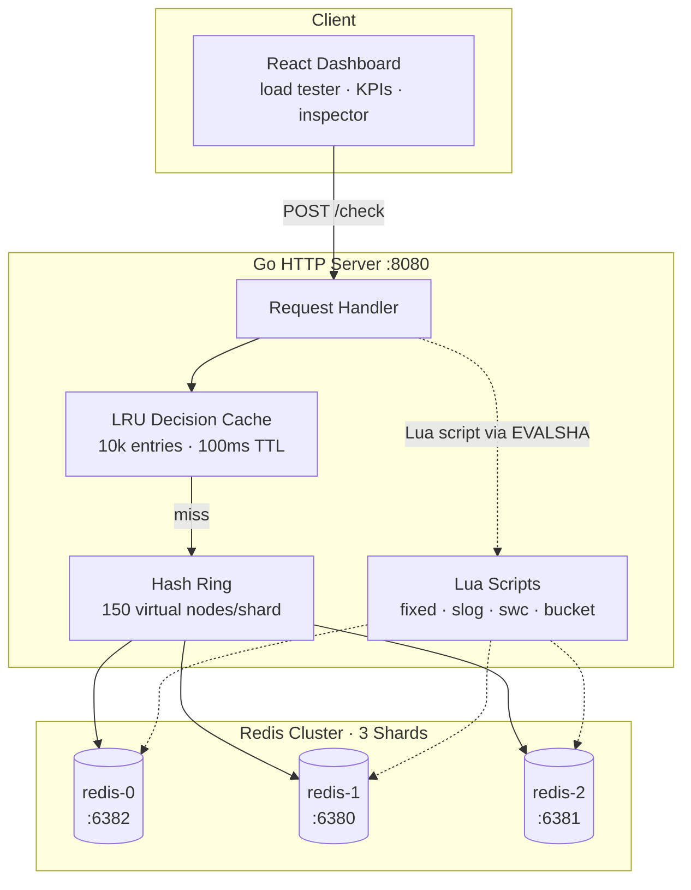

# Distributed Rate Limiter

[](https://go.dev)
[](https://redis.io)
[](LICENSE)

A production-style rate limiter in Go: four algorithms, atomic operations
via Lua, an LRU decision cache, and a 3-shard Redis cluster behind a
consistent hash ring. Pushes **18,769 req/s over HTTP** at **p95 16 ms**
on a MacBook Air. At sustained 2,000 req/s with 1,000 distinct keys,
**p50 is 343 µs and p99 stays under 2 ms**.

Comes with a live React dashboard for load testing, key inspection,
and per-algorithm comparison.

> Companion repo: [ratelimit-dashboard](https://github.com/sameer-sde/ratelimit-dashboard)
> — the React dashboard that drives load tests against this backend.

---

## Why this project

Rate limiting sits at the front of every serious API — payment gateways,
auth services, public APIs. Building one teaches:

- **Distributed-systems primitives** (consistent hashing, sharding)
- **Atomicity under concurrency** (race conditions, Redis Lua scripts)
- **Cache design** (LRU with TTL, hit-rate tradeoffs)
- **Performance work** (measure → hypothesize → tune → re-measure)

This isn't a tutorial reimplementation — it's the design I'd ship if I
had to build a rate limiter for a real service tomorrow, scaled down to
one laptop.

---

## Architecture

```
                   ┌─────────────────────┐
                   │  React Dashboard    │
                   │  (load tester, KPI, │
                   │   key inspector)    │
                   └──────────┬──────────┘
                              │ HTTP
                              ▼
                   ┌─────────────────────┐
                   │   Go HTTP Server    │
                   │   /check  /metrics  │
                   │   /inspect /load    │
                   └──────────┬──────────┘
                              │
                ┌─────────────┼─────────────┐
                ▼             ▼             ▼
        ┌────────────┐ ┌────────────┐ ┌────────────┐
        │ LRU Cache  │ │ Hash Ring  │ │ Lua Scripts│
        │ (10k, TTL) │ │ (150 vnode)│ │ (atomic)   │
        └────────────┘ └─────┬──────┘ └────────────┘
                             │
              ┌──────────────┼──────────────┐
              ▼              ▼              ▼
        ┌──────────┐   ┌──────────┐   ┌──────────┐
        │ redis-0  │   │ redis-1  │   │ redis-2  │
        │  :6382   │   │  :6380   │   │  :6381   │
        └──────────┘   └──────────┘   └──────────┘
```

**Request flow:** dashboard → Go server → LRU cache check → hash ring picks
shard → Lua script runs atomically on that Redis → result returned.

### Detailed view



---

## Algorithms

Four algorithms, all atomic via Redis Lua scripts (single-threaded
execution on the Redis side eliminates check-then-act races).

| Algorithm                   | Redis structure       | Memory   | Accuracy |
|-----------------------------|-----------------------|----------|----------|
| **Fixed Window**            | INCR + EXPIRE         | O(1)     | Coarse — boundary spike risk |
| **Sliding Window Log**      | Sorted set per key    | O(N)     | Exact    |
| **Sliding Window Counter**  | Two integer buckets   | O(1)     | ~99% — weighted average     |
| **Token Bucket**            | Hash (tokens, last_us)| O(1)     | Exact — handles bursts well |

Each lives in `internal/limiter/<name>.lua` (the algorithm) and
`<name>.go` (the wrapper that loads the script via `redis.NewScript`
and parses the result).

---

## Performance

All measured on **MacBook Air (Apple Silicon)**, localhost, with three
Redis containers behind the hash ring.

### Peak throughput — Fixed Window (k6, 200 VUs, 45s)

| Metric           | Value      |
|------------------|-----------:|
| Sustained RPS    | **18,769** |
| Total requests   | 844,619    |
| p95 latency      | 15.93 ms   |
| p90 latency      | 13.55 ms   |
| Errors           | 0.00%      |

### Latency at sustained 2,000 RPS, 1,000 distinct keys

| Metric           | Value      |
|------------------|-----------:|
| p50 (median)     | **343 µs** |
| p95              | 724 µs     |
| p99              | **1.93 ms**|
| Errors           | 0.00%      |

Sub-millisecond p95 confirms the system has significant headroom at
realistic production load.

### Day 14 tuning — before/after

Two config changes, same machine, back-to-back runs:

- Redis connection pool: 10 → **50 per shard** (3 shards = 150 total)
- HTTP server: `IdleTimeout: 120s`, tighter read/write, smaller header cap

| Metric        | Before    | After     | Delta     |
|---------------|----------:|----------:|----------:|
| RPS           | 11,657    | **18,769**| **+61%**  |
| p95 latency   | 28.08 ms  | 15.93 ms  | **-43%**  |
| avg latency   | 13.34 ms  | 8.42 ms   | -37%      |

The default 10-connection pool was the bottleneck. With 200 concurrent
goroutines competing, requests queued waiting for a free connection.

### Hash ring consistency

The reason for consistent hashing: scaling the cluster shouldn't
invalidate most state.

- Adding a 5th shard to a 4-shard cluster: **21.32% of keys remap**
  (theoretical: 1/N = 20%)
- Removing 1 of 5 shards: **20.07% of keys remap** (theoretical: 20%)
- Distribution across 5 shards / 10,000 keys: worst deviation 11.55%
  from mean

Full property tests in `internal/hashring/ring_test.go`.

### LRU decision cache

Caches *denials only* (allows must hit Redis to increment the counter).
TTL bounded by the rate-limit window.

- **93.5% cache hit rate** measured against a single hot key
- Each cache hit saves a round trip to Redis (~200µs)

---

## Quick start

Requirements: Docker, Go 1.22+, Node 18+ (for the dashboard).

```bash
git clone https://github.com/sameer-sde/ratelimit
cd ratelimit

# Start three Redis containers
docker compose up -d

# Start the Go server
go run ./cmd/server
```

Server listens on `http://localhost:8080`. Try it:

```bash
curl -X POST http://localhost:8080/check \
  -H 'Content-Type: application/json' \
  -d '{"key":"user_42","limit":5,"window":60,"algorithm":"fixed"}'
```

Run it twice and you'll see `"allowed": true` flip to `"allowed": false`
once you exceed the limit.

For the dashboard:

```bash
git clone https://github.com/sameer-sde/ratelimit-dashboard
cd ratelimit-dashboard
npm install
npm run dev
```

Opens on `http://localhost:5180`.

---

## API

### `POST /check`
Decide if a request is allowed.

```json
{
  "key": "user_42",
  "limit": 100,
  "window": 60,
  "algorithm": "fixed"
}
```

Token bucket uses different parameters:

```json
{
  "key": "user_42",
  "capacity": 100,
  "refill": 10,
  "algorithm": "bucket"
}
```

Returns `200 OK` (allowed) or `429 Too Many Requests` (rate-limited),
with the responsible shard in the body.

### Other endpoints

| Endpoint                  | Purpose                                |
|---------------------------|----------------------------------------|
| `GET /health`             | Liveness probe                         |
| `GET /metrics`            | Total reqs, allows, denies, cache stats, per-algorithm totals |
| `GET /cluster/info`       | Shard topology; `?key=X` returns the shard owning X |
| `GET /inspect/<key>`      | Raw Redis state for a key, across all four algorithms |
| `GET /cache/stats`        | LRU cache hits / misses / size         |
| `POST /load-test`         | In-process load test (no HTTP overhead) |

---

## Repository layout

```
ratelimit/
├── cmd/
│   ├── server/             # HTTP server + endpoints
│   └── ringdemo/           # CLI demo for the hash ring
├── internal/
│   ├── limiter/            # 4 algorithms, each .lua + .go pair
│   ├── cache/              # LRU with TTL
│   ├── hashring/           # Consistent hash ring + tests
│   └── rediscluster/       # Multi-Redis wrapper
├── benchmarks/             # k6 scripts + result files + RESULTS.md
└── docker-compose.yml      # Three Redis containers
```

---

## What I'd build next

- **Multi-region replication** — currently single-region. AWS-style
  global rate limiting would need a CRDT or async replication layer.
- **Backpressure when a shard is down** — right now a dead shard
  silently fails requests routed to it; a real system would mark the
  shard down and either reject or fall back to a neighbor.
- **gRPC alongside HTTP** — for service-to-service callers, gRPC
  shaves ~30% of per-request overhead.

---

## Acknowledgments

Built over ~6 weeks of evening and weekend work as a learning project.
Influences: [Stripe's rate limiter blog post](https://stripe.com/blog/rate-limiters),
the Designing Data-Intensive Applications chapter on partitioning, and
the Cloudflare engineering blog's posts on consistent hashing.
